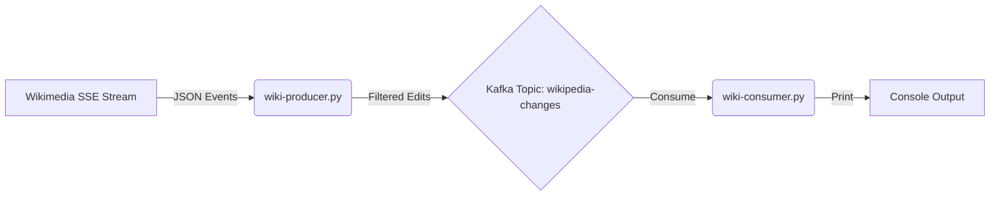

# Exercise 01: Wikimedia Real-Time Stream Processing

## Problem Statement

The goal of this exercise is to build a real-time data streaming pipeline that ingests recent changes from Wikipedia and filters them for specific criteria using Apache Kafka.

You will implement two components:
1.  **Producer (`wiki-producer.py`)**: Connects to the Wikimedia EventStreams API, captures "edit" events, and publishes simplified messages to a Kafka topic.
2.  **Consumer (`wiki-consumer.py`)**: Subscribes to the Kafka topic and processes the stream to surface interesting edits (e.g., bot activity or human edits).

## Architecture



## Requirements

### 1. Producer (`wiki-producer.py`)
-   **Source**: Connect to `https://stream.wikimedia.org/v2/stream/recentchange` using Server-Sent Events (SSE).
-   **Filter**: Process only events where `type` is `"edit"`.
-   **Transform**: Extract the following fields into a new JSON object:
    -   `title`: Title of the page
    -   `user`: user who made the change
    -   `type`: type of event (should be "edit")
    -   `bot`: Boolean indicating if it's a bot
    -   `minor`: Boolean indicating if it's a minor edit
-   **Sink**: Produce these messages to the Kafka topic `wikipedia-changes`.
-   **Keying**: Use the page `title` as the message key to ensure strict ordering for updates to the same page.

### 2. Consumer (`wiki-consumer.py`)
-   **Source**: Consume from the `wikipedia-changes` topic.
-   **Logic**:
    -   Print a message if a **Bot** made a **non-minor** change.
    -   Print a message if a **Human** made a change (minor or non-minor).
-   **Output Format**:
    -   `🤖 [User] made a non-minor change to [Title]`
    -   `👤 [User] made a [minor/non-minor] change to [Title]`

## Setup & Running

1.  **Start Kafka**:
    ```bash
    cd ../../docker
    docker compose up -d
    ```

2.  **Run Producer**:
    ```bash
    uv run wiki-producer.py
    ```

3.  **Run Consumer** (in a separate terminal):
    ```bash
    uv run wiki-consumer.py
    ```
