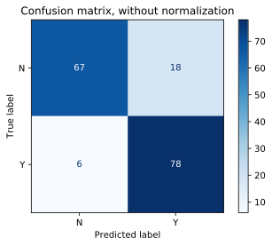

# Sklearn Pipeline Example
* [Resource](https://medium.com/vickdata/a-simple-guide-to-scikit-learn-pipelines-4ac0d974bdcf)


```python
## Improrting data
import pandas as pd
train = pd.read_csv(r'.\dataset\train_ctrUa4K.csv')
test = pd.read_csv(r'.\dataset\test_lAUu6dG.csv')
train = train.drop('Loan_ID', axis='columns')
train.dtypes
```


    Gender                object
    Married               object
    Dependents            object
    Education             object
    Self_Employed         object
    ApplicantIncome        int64
    CoapplicantIncome    float64
    LoanAmount           float64
    Loan_Amount_Term     float64
    Credit_History       float64
    Property_Area         object
    Loan_Status           object
    dtype: object


```python
# check class labels counts
print("Train labels")
print(train['Loan_Status'].value_counts())
```

    Train labels
    Y    422
    N    192
    Name: Loan_Status, dtype: int64
    

Clearly, there is huge class imbalance. So, first we need to balance the training data or we are gonna mess up the model pretty bad. For more info about this head [here](https://elitedatascience.com/imbalanced-classes).


## Handling Class Imbalance

### 1. Upsampling minority class


```python
from sklearn.utils import resample

df = train.copy()
# Separate majority and minority classes
df_majority = df[df.Loan_Status=='Y']
df_minority = df[df.Loan_Status=='N']
 
# Upsample minority class
df_minority_upsampled = resample(df_minority, 
                                 replace=True,     # sample with replacement
                                 n_samples=422,    # to match majority class
                                 random_state=123) # reproducible results
 
# Combine majority class with upsampled minority class
df_upsampled = pd.concat([df_majority, df_minority_upsampled])
 
# Display new class counts
df_upsampled.Loan_Status.value_counts()
```


    Y    422
    N    422
    Name: Loan_Status, dtype: int64


## 2. Downsampling majority class


```python
# Downsample majority class
df_majority_downsampled = resample(df_majority, 
                                 replace=False,    # sample without replacement
                                 n_samples=192,     # to match minority class
                                 random_state=123) # reproducible results
 
# Combine minority class with downsampled majority class
df_downsampled = pd.concat([df_majority_downsampled, df_minority])
 
# Display new class counts
df_downsampled.Loan_Status.value_counts()
```


    Y    192
    N    192
    Name: Loan_Status, dtype: int64


```python
# I'll train only on one fo these, but feel free to try them all

# Actual Dataset
# X = train.drop('Loan_Status', axis='columns')
# y = train['Loan_Status']

# Upsampled Dataset
X = df_upsampled.drop('Loan_Status', axis='columns')
y = df_upsampled['Loan_Status']

# Downsampled Dataset
# X = df_downsampled.drop('Loan_Status', axis='columns')
# y = df_downsampled['Loan_Status']

```


```python
from sklearn.model_selection import train_test_split
X_train, X_test, y_train, y_test = train_test_split(X, y, test_size=0.2, random_state=42)
```


```python
# sanity check
print(f"X_train.shape : {X_train.shape}")
print(f"X_test.shape : {X_test.shape}")
print(f"y_train.shape : {y_train.shape}")
print(f"y_test.shape : {y_test.shape}")

```

    X_train.shape : (675, 11)
    X_test.shape : (169, 11)
    y_train.shape : (675,)
    y_test.shape : (169,)
    


```python
from sklearn.pipeline import Pipeline
from sklearn.impute import SimpleImputer
from sklearn.preprocessing import StandardScaler, OneHotEncoder

numeric_transformer = Pipeline(
    steps=[
        ('imputer', SimpleImputer(strategy='median')), # impute missing values by column median
        ('scaler', StandardScaler()) # scale values to 0-1 range
    ]
)

categorical_transformer = Pipeline(
    steps=[
        ('imputer', SimpleImputer(strategy='constant', fill_value='missing')), # impute missing values with 'missing'
        ('onehot', OneHotEncoder(handle_unknown='ignore'))
    ]
)
```


```python
# get numeric and categorical features
numeric_features = train.select_dtypes(include=['int64', 'float64']).columns
print(f"numeric_features: {numeric_features}")
categorical_features = train.select_dtypes(include=['object']).drop(['Loan_Status'], axis=1).columns
print(f"categorical_features: {categorical_features}")
```

    numeric_features: Index(['ApplicantIncome', 'CoapplicantIncome', 'LoanAmount',
           'Loan_Amount_Term', 'Credit_History'],
          dtype='object')
    categorical_features: Index(['Gender', 'Married', 'Dependents', 'Education', 'Self_Employed',
           'Property_Area'],
          dtype='object')
    


```python
# use column transformer to preprocess different columns
from sklearn.compose import ColumnTransformer
preprocessor = ColumnTransformer(
    transformers=[
        ('num', numeric_transformer, numeric_features),
        ('cat', categorical_transformer, categorical_features)
    ]
)
```


```python
preprocessor.fit_transform(X_train)[:1]
```


    array([[-0.29123625, -0.47894872, -0.79986728, -4.38179372,  0.51845636,
             0.        ,  1.        ,  0.        ,  1.        ,  0.        ,
             0.        ,  1.        ,  0.        ,  0.        ,  0.        ,
             0.        ,  0.        ,  1.        ,  1.        ,  0.        ,
             0.        ,  0.        ,  1.        ,  0.        ]])


```python
# Creating a random forest classifier and fitting it to data
from sklearn.ensemble import RandomForestClassifier

rf = Pipeline(
    steps=[
        ('preprocessor', preprocessor),
        ('classifier', RandomForestClassifier())
    ]
)

rf.fit(X_train, y_train)
```


    Pipeline(memory=None,
             steps=[('preprocessor',
                     ColumnTransformer(n_jobs=None, remainder='drop',
                                       sparse_threshold=0.3,
                                       transformer_weights=None,
                                       transformers=[('num',
                                                      Pipeline(memory=None,
                                                               steps=[('imputer',
                                                                       SimpleImputer(add_indicator=False,
                                                                                     copy=True,
                                                                                     fill_value=None,
                                                                                     missing_values=nan,
                                                                                     strategy='median',
                                                                                     verbose=0)),
                                                                      ('scaler',
                                                                       StandardScaler(copy=True,
                                                                                      with_mean...
                     RandomForestClassifier(bootstrap=True, ccp_alpha=0.0,
                                            class_weight=None, criterion='gini',
                                            max_depth=None, max_features='auto',
                                            max_leaf_nodes=None, max_samples=None,
                                            min_impurity_decrease=0.0,
                                            min_impurity_split=None,
                                            min_samples_leaf=1, min_samples_split=2,
                                            min_weight_fraction_leaf=0.0,
                                            n_estimators=100, n_jobs=None,
                                            oob_score=False, random_state=None,
                                            verbose=0, warm_start=False))],
             verbose=False)


```python
print(X_train.shape)
# print(len(preds))
print(len(y_test.values))

```

    (675, 11)
    169
    


```python
preds = rf.predict(X_train)
print(preds[:10])
# print(preds, len(preds), len(y_test), y_test)
rf.score(X_test, y_test.values)
```

    ['N' 'N' 'N' 'Y' 'Y' 'N' 'N' 'N' 'N' 'Y']
    


    0.9112426035502958


```python
# Using Gridsearch for hyperparameter tuning
param_grid = { 
    'classifier__n_estimators': [200, 500],
    'classifier__max_features': ['auto', 'sqrt', 'log2'],
    'classifier__max_depth' : [4,5,6,7,8],
    'classifier__criterion' :['gini', 'entropy']
}

from sklearn.model_selection import GridSearchCV
CV = GridSearchCV(rf, param_grid, n_jobs= -1)
                  
CV.fit(X_train, y_train)  
print(CV.best_params_)    
print(CV.best_score_)
```

    {'classifier__criterion': 'gini', 'classifier__max_depth': 8, 'classifier__max_features': 'auto', 'classifier__n_estimators': 500}
    0.8103703703703704
    


```python
# Create a new classifer using the best parameters
# Creating a random forest classifier and fitting it to data
from sklearn.ensemble import RandomForestClassifier

rf = Pipeline(
    steps=[
        ('preprocessor', preprocessor),
        ('classifier', RandomForestClassifier(criterion='entropy', 
                                              max_depth=7,
                                              max_features='log2',
                                              n_estimators=500))
    ]
)

rf.fit(X_train, y_train)
print(f"Training Score: {rf.score(X_train, y_train)}")
print(f"Testing Score: {rf.score(X_test, y_test)}")

```

    Training Score: 0.8933333333333333
    Testing Score: 0.834319526627219
    

All the above process can also be done in a different way, using make_pipeline and make_column_transformer, key difference being, we won't need to pass name of the process. More about it can be find [here](https://jorisvandenbossche.github.io/blog/2018/05/28/scikit-learn-columntransformer/).


```python
from sklearn.compose import make_column_transformer
from sklearn.pipeline import make_pipeline

preprocessor2 = make_column_transformer(
    (
        # numeric_features,
        make_pipeline(
            SimpleImputer(), # left empty, will be used in grid search
            StandardScaler()
        ),
        numeric_features
    ),
    (
        # categorical_features,
        make_pipeline(
            SimpleImputer(strategy='constant', fill_value='missing'),
            OneHotEncoder(handle_unknown='ignore')
        ),
        categorical_features
    )
)

# check one of the preprocessed output
preprocessor2.fit_transform(X_train)[:1]
```


    array([[-0.29123625, -0.47894872, -0.81117297, -4.37913606,  0.56709403,
             0.        ,  1.        ,  0.        ,  1.        ,  0.        ,
             0.        ,  1.        ,  0.        ,  0.        ,  0.        ,
             0.        ,  0.        ,  1.        ,  1.        ,  0.        ,
             0.        ,  0.        ,  1.        ,  0.        ]])


```python
# Random Forest Model
rf_model = make_pipeline(
    preprocessor2,
    RandomForestClassifier() # This will clearly overfit
)
rf_model.fit(X_train, y_train)
print(f"Training Score: {rf_model.score(X_train, y_train)}")
print(f"Testing Score: {rf_model.score(X_test, y_test)}")

```

    Training Score: 1.0
    Testing Score: 0.893491124260355
    

## Using GridSearch in Column Transformer


```python
# create an empty parameter grid 
param_grid = {}
# Get a list of parameters that we can tune
grid_clf = GridSearchCV(rf_model, param_grid, cv=10, iid=False)
for val in grid_clf.estimator.get_params().keys():
    print(val)
```

    memory
    steps
    verbose
    columntransformer
    randomforestclassifier
    columntransformer__n_jobs
    columntransformer__remainder
    columntransformer__sparse_threshold
    columntransformer__transformer_weights
    columntransformer__transformers
    columntransformer__verbose
    columntransformer__pipeline-1
    columntransformer__pipeline-2
    columntransformer__pipeline-1__memory
    columntransformer__pipeline-1__steps
    columntransformer__pipeline-1__verbose
    columntransformer__pipeline-1__simpleimputer
    columntransformer__pipeline-1__standardscaler
    columntransformer__pipeline-1__simpleimputer__add_indicator
    columntransformer__pipeline-1__simpleimputer__copy
    columntransformer__pipeline-1__simpleimputer__fill_value
    columntransformer__pipeline-1__simpleimputer__missing_values
    columntransformer__pipeline-1__simpleimputer__strategy
    columntransformer__pipeline-1__simpleimputer__verbose
    columntransformer__pipeline-1__standardscaler__copy
    columntransformer__pipeline-1__standardscaler__with_mean
    columntransformer__pipeline-1__standardscaler__with_std
    columntransformer__pipeline-2__memory
    columntransformer__pipeline-2__steps
    columntransformer__pipeline-2__verbose
    columntransformer__pipeline-2__simpleimputer
    columntransformer__pipeline-2__onehotencoder
    columntransformer__pipeline-2__simpleimputer__add_indicator
    columntransformer__pipeline-2__simpleimputer__copy
    columntransformer__pipeline-2__simpleimputer__fill_value
    columntransformer__pipeline-2__simpleimputer__missing_values
    columntransformer__pipeline-2__simpleimputer__strategy
    columntransformer__pipeline-2__simpleimputer__verbose
    columntransformer__pipeline-2__onehotencoder__categories
    columntransformer__pipeline-2__onehotencoder__drop
    columntransformer__pipeline-2__onehotencoder__dtype
    columntransformer__pipeline-2__onehotencoder__handle_unknown
    columntransformer__pipeline-2__onehotencoder__sparse
    randomforestclassifier__bootstrap
    randomforestclassifier__ccp_alpha
    randomforestclassifier__class_weight
    randomforestclassifier__criterion
    randomforestclassifier__max_depth
    randomforestclassifier__max_features
    randomforestclassifier__max_leaf_nodes
    randomforestclassifier__max_samples
    randomforestclassifier__min_impurity_decrease
    randomforestclassifier__min_impurity_split
    randomforestclassifier__min_samples_leaf
    randomforestclassifier__min_samples_split
    randomforestclassifier__min_weight_fraction_leaf
    randomforestclassifier__n_estimators
    randomforestclassifier__n_jobs
    randomforestclassifier__oob_score
    randomforestclassifier__random_state
    randomforestclassifier__verbose
    randomforestclassifier__warm_start
    


```python
# create a parameter grid based on the parameters 
param_grid = {
    'columntransformer__pipeline-1__simpleimputer__strategy': ['mean', 'median'],
    'randomforestclassifier__n_estimators': [200, 500],
    'randomforestclassifier__max_features': ['auto', 'sqrt', 'log2'],
    'randomforestclassifier__max_depth' : [4,5,6,7,8],
    'randomforestclassifier__criterion' :['gini', 'entropy']
    }
```


```python
grid_clf = GridSearchCV(estimator=rf_model, 
                        param_grid=param_grid, 
                        cv=3, # kfolds cross validation
                        n_jobs=-1, # use all processors
                        refit=True, # fit best classifier on train data at end, default=True
                        return_train_score=True)
grid_clf.fit(X_train, y_train)
```


    GridSearchCV(cv=3, error_score=nan,
                 estimator=Pipeline(memory=None,
                                    steps=[('columntransformer',
                                            ColumnTransformer(n_jobs=None,
                                                              remainder='drop',
                                                              sparse_threshold=0.3,
                                                              transformer_weights=None,
                                                              transformers=[('pipeline-1',
                                                                             Pipeline(memory=None,
                                                                                      steps=[('simpleimputer',
                                                                                              SimpleImputer(add_indicator=False,
                                                                                                            copy=True,
                                                                                                            fill_value=None,
                                                                                                            missing_values=nan,
                                                                                                            strategy='me...
                 param_grid={'columntransformer__pipeline-1__simpleimputer__strategy': ['mean',
                                                                                        'median'],
                             'randomforestclassifier__criterion': ['gini',
                                                                   'entropy'],
                             'randomforestclassifier__max_depth': [4, 5, 6, 7, 8],
                             'randomforestclassifier__max_features': ['auto',
                                                                      'sqrt',
                                                                      'log2'],
                             'randomforestclassifier__n_estimators': [200, 500]},
                 pre_dispatch='2*n_jobs', refit=True, return_train_score=True,
                 scoring=None, verbose=0)


```python
# print best model hyperparameters
print(grid_clf.best_params_)
```

    {'columntransformer__pipeline-1__simpleimputer__strategy': 'median', 'randomforestclassifier__criterion': 'gini', 'randomforestclassifier__max_depth': 8, 'randomforestclassifier__max_features': 'auto', 'randomforestclassifier__n_estimators': 200}
    


```python
# print parameters of best model
best_model = grid_clf.best_estimator_
print(best_model)
```

    Pipeline(memory=None,
             steps=[('columntransformer',
                     ColumnTransformer(n_jobs=None, remainder='drop',
                                       sparse_threshold=0.3,
                                       transformer_weights=None,
                                       transformers=[('pipeline-1',
                                                      Pipeline(memory=None,
                                                               steps=[('simpleimputer',
                                                                       SimpleImputer(add_indicator=False,
                                                                                     copy=True,
                                                                                     fill_value=None,
                                                                                     missing_values=nan,
                                                                                     strategy='median',
                                                                                     verbose=0)),
                                                                      ('standardscaler',
                                                                       Standard...
                     RandomForestClassifier(bootstrap=True, ccp_alpha=0.0,
                                            class_weight=None, criterion='gini',
                                            max_depth=8, max_features='auto',
                                            max_leaf_nodes=None, max_samples=None,
                                            min_impurity_decrease=0.0,
                                            min_impurity_split=None,
                                            min_samples_leaf=1, min_samples_split=2,
                                            min_weight_fraction_leaf=0.0,
                                            n_estimators=200, n_jobs=None,
                                            oob_score=False, random_state=None,
                                            verbose=0, warm_start=False))],
             verbose=False)
    


```python
# print accuracy of best model on test data
print("best model from grid search: ", best_model.score(X_test, y_test))

```

    best model from grid search:  0.8579881656804734
    


```python
# save the best model
import joblib
joblib.dump(best_model, 'best_model.joblib')
```


    ['best_model.joblib']


```python
# load saved model
import joblib
loaded_model = joblib.load('best_model.joblib')
```


```python
# checking accuracy score via loaded model
print(loaded_model.score(X_test, y_test))
```

    0.8579881656804734
    

Same as that of best_model. So, SUCCESS!

## Plotting Confusion Matrix


```python
import matplotlib.pyplot as plt
from sklearn.metrics import plot_confusion_matrix
# Plot non-normalized confusion matrix
titles_options = [("Confusion matrix, without normalization", None),
                  ("Normalized confusion matrix", 'true')]
for title, normalize in titles_options:
    disp = plot_confusion_matrix(loaded_model, X_test, y_test,
                                #  display_labels=class_names,
                                 cmap=plt.cm.Blues,
                                 normalize=normalize)
    disp.ax_.set_title(title)

    print(title)
    print(disp.confusion_matrix)

plt.show()
```

    Confusion matrix, without normalization
    [[67 18]
     [ 6 78]]
    Normalized confusion matrix
    [[0.78823529 0.21176471]
     [0.07142857 0.92857143]]
    





```python

```
